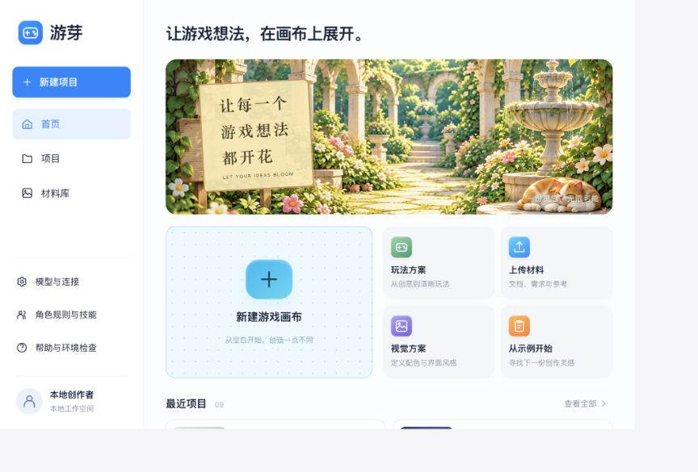
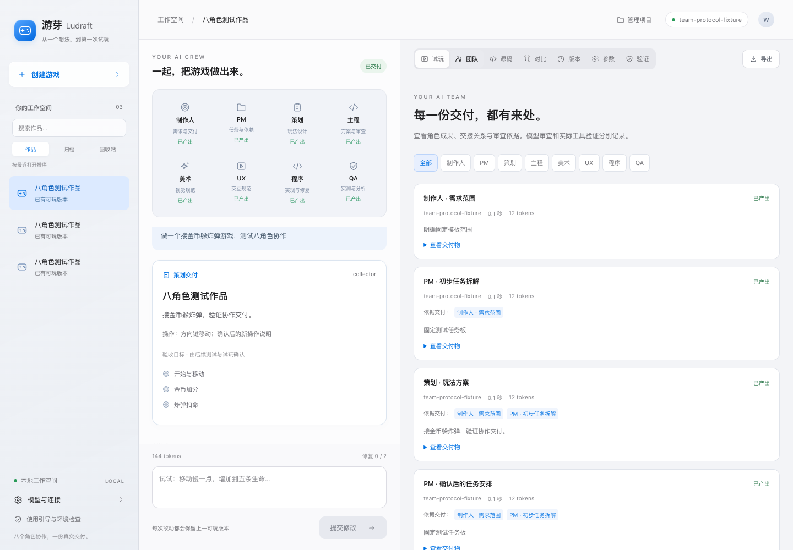
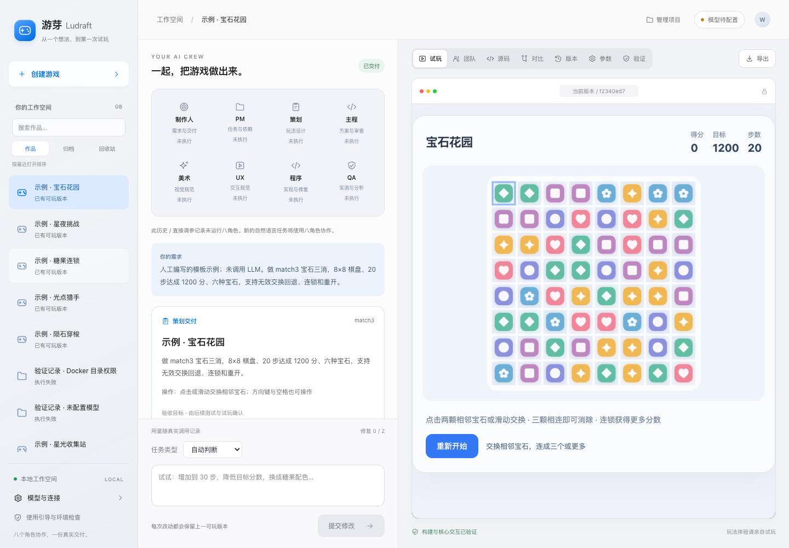

<h1 align="center">游芽 · Ludraft</h1>

<p align="center">
  <strong>简体中文</strong> · <a href="README.en.md">English</a>
</p>

<hr>

<p align="center">
  <code>AI 网页游戏工作台 · 从想法到试玩</code>
</p>

<p align="center">
  <strong>让一个游戏想法，长成可以试玩的作品。</strong>
</p>

<p align="center">
  描述玩法、确认方案，通过制作人、PM、策划、主程、程序、美术、UX 与 QA 协作，完成生成、试玩、修改和源码导出。
</p>

<p align="center">
  
  
  
  
  
  
</p>

<p align="center">
  玩法确认 · 八角色协作 · 浏览器试玩 · 版本回退
</p>

<p align="center">
  <a href="#about">这是什么</a>
  ·
  <a href="#features">功能</a>
  ·
  <a href="#quick-start">安装</a>
  ·
  <a href="#architecture">架构</a>
  ·
  <a href="#security">安全边界</a>
  ·
  <a href="#preview">本地预览</a>
</p>

<p align="center">
  <a href="docs/assets/ludraft-canvas-home.png">
    
  </a>
</p>

<p align="center">
  <sub>本地工作台真实截图 · 点击查看大图</sub>
</p>

<a id="about"></a>

## 什么是「游芽」？

「游芽」面向多类型 2D 网页游戏创作，当前提供接物、躲避、点击和 8×8 三消四种 TypeScript Canvas 玩法。输入一段自然语言需求，先确认玩法和验收条件，再生成固定 TypeScript + Canvas 模板中的代码变更，经过构建与浏览器测试后交付可试玩版本。

第一次交付之后，可以继续提出“增加到 30 步”“降低目标分数”“修改宝石配色”等要求，查看每次改动的源码、差异与验证证据，并在需要时回退或导出。

<a id="features"></a>

## 六个核心模块

| 模块 | 用户价值 | 当前能力 |
| --- | --- | --- |
| 需求与玩法确认 | 先明确要做什么，再开始生成 | 自然语言需求、文档/文件夹上传与提取核对、灵感卡片、可编辑的策划方案与验收条件、保存后确认与退回 |
| 八角色协作 | 把创意、实现和验证串成完整流程 | 独立角色交付、动态编码分工、定向/广播消息、上下文投递记录；角色规则与技能、澄清暂停、用户答复与重新确认 |
| 隔离构建与测试 | 尽早发现代码和交互问题 | Docker 内构建与 Chromium 测试，逐项验证报告；模型生成失败最多自动修复两轮 |
| 浏览器试玩 | 直接体验游戏并提出反馈 | 独立来源的受限 iframe，根据确认玩法选择 Canvas 模板，四种模式均可创建和迭代 |
| 持续修改与版本 | 保留上一份可玩的作品 | 自然语言修改与参数面板、任意两版对比、不可变快照、失败保护、历史试玩与回退；项目搜索、复制、归档和回收站 |
| 导出与评测 | 带走成果，并保留验证依据 | ZIP 导出源码、构建产物、验证证据和角色交付物；固定五条需求的模板回归与真实模型评测脚本 |

## 画布创作界面

多类型接入期间，可在「模型与连接」或「帮助与环境检查」中展开「OpenGame 执行与预算」，查看编码环境、程序角色配置、登记单价、费用预留和最近的编码/构建记录，并显式核查待清理资源。刷新不调用模型；本地条件通过不等于真实模型或游戏验收通过，塔防创作入口仍在接入。详细进度见[迭代计划](docs/OPENGAME-INTEGRATION-PLAN.md)。

首页选择任务或新建空白画布，在需求确认后进入创作。项目画布将玩法/参考卡片、真实试玩和修改输入放在一起；顶部工具栏可打开参数、材料、源码、版本、验证和进度，团队与消息入口保留八角色交付记录。

桌面支持拖动卡片标题、平移、缩放和视图复位；手机采用纵向布局。画布位置与缩放保存在当前浏览器，参考图片使用 IndexedDB 按项目保存。图片仅用于本地画布参考，不会自动发送给模型或写入游戏导出包；需要团队采用的风格应写入需求，文档材料仍需上传核对。

[查看项目画布截图](docs/assets/ludraft-canvas-project.png) · [查看手机界面](docs/assets/ludraft-canvas-mobile.png) · [界面规格与边界](docs/UI_REFERENCE.md)

## 示例体验与本地生成

| 能力 | 内置示例体验 | 配置模型后的生成流程 |
| --- | --- | --- |
| 浏览工作台与项目 | 可用 | 可用 |
| 游戏试玩、源码、差异与导出 | 导入示例后可用 | 版本实际验证通过后可用 |
| 自然语言策划与生成 | 示例本身不需要模型 | 需要可用的兼容模型接口 |
| 调整步数、目标、宝石种类与配色 | 参数面板直接修改，仍需容器验证 | 参数面板或自然语言修改，验证通过后发布 |
| Docker 与测试镜像 | 导入示例时需要 | 每次构建与测试都需要 |
| 数据去向 | 本机 SQLite、项目与版本目录 | 本机存储；需求、相关代码及测试信息会发送给所配置的模型服务 |

项目目前没有公开在线演示。完整工作台需要本地 API、SQLite 和 Docker，单独发布前端静态文件不能替代完整运行环境。

<a id="architecture"></a>

## 技术架构

| 层级 | 技术栈 | 职责 |
| --- | --- | --- |
| Web 工作台 | React 18、TypeScript、Vite 6 | 需求、审批、日志、试玩、源码、版本与模型设置；浅色界面与线性 SVG 图标 |
| API 与调度 | Python 3.12、FastAPI、asyncio | 项目与任务接口、明确的状态流、取消、交接与修复调度 |
| 本地数据 | SQLite、文件系统 | 项目、运行、事件和版本元数据；候选文件与版本快照 |
| 模型接入 | HTTPX、Pydantic、OpenAI 兼容与 Anthropic Messages 协议 | 结构化玩法和文件变更校验、错误与可获得的 token 用量记录 |
| 游戏模板 | TypeScript、Canvas 2D | collector 接物、dodger 躲避、clicker 点击、match3 三消及对应参数 |
| 隔离验证 | Docker、TypeScript 5.9、Playwright 1.56、Chromium | 固定构建、浏览器交互检查与测试证据生成 |
| 游戏预览 | 独立 FastAPI 服务、受限 iframe、CSP | 与管理接口分离的静态游戏预览 |

```text
制作人明确范围 → PM 初步拆解 → 策划方案 → 用户确认
                                         ↓
                               PM 按确认方案更新任务依赖
                                         ↓
                         主程技术方案 / 美术规范 / UX 规范
                         （依赖满足才执行，独立设计可并行）
                                         ↓
                                     程序实现
                                         ↓
                            主程审查 + QA 测试策略
                                         ↓
                             容器实测 → QA 证据分析
                                         ↓
               通过 → 制作人交付决策 → 发布可玩版本
               未通过 → 责任角色修订 → 程序修复 → 重新审查与实测
```

主程与 QA 的阻断问题、实际工具失败都会阻止发布；制作人接受交付后才发布版本。角色通过持久化交付物及消息协作，调度器执行依赖图。消息发送给后续角色调用；向用户请求澄清时暂停，答复后重新策划并再次确认。消息本身不会绕过审批、依赖或测试门禁。详细状态和接口见[架构说明](docs/ARCHITECTURE.md)。

## 角色规则与技能

通过侧栏「角色规则与技能」查看上游角色原文和步骤文档，为角色填写补充要求、选用技能或创建自定义 Markdown 技能。默认使用通用游戏设计、Canvas 实现和验证证据三类技能；三消专项设计技能仍可选用；上游 Unity/C# 技能可作为参考，不代表接入了对应引擎或工具。

每次角色调用按当前任务加载一份步骤说明，并保存实际文档内容、设置版本与 SHA-256。团队面板可查看调用快照；编辑规则或技能不会改写历史记录，角色设置支持恢复默认及历史版本。自定义内容不能改变文件权限、审批和工具测试门禁。ZIP 包含规则快照时同时附带上游 MIT 许可。

## 上传游戏需求材料

在需求框选择「上传材料」或「上传文件夹」，可导入文本、PDF、DOCX 和 ZIP。先查看提取结果、修正关卡步数与目标等关键信息，再点击「核对并用于本轮需求」。上传和解析本身不调用模型；提交创作或修改需求后，八角色读取这一轮保存的核对稿。

材料库支持复用和删除未引用副本。任务保留原文件摘要、提取摘要和核对稿；后续修改材料不会覆盖历史。导出 ZIP 的 `requirements.json` 包含当前及来源任务的核对稿，不包含上传的原始二进制文件。

单文件最多 8 MB；每轮最多 8 份材料，单份核对稿 2 万字、合计 4 万字。扫描 PDF 需要先转成文字，不支持 OCR、DOC/RAR 和嵌套 ZIP；图片和不支持的文件会显示跳过或失败原因。复杂表格、排版和文字提取仍需人工核对。

## 环境要求

- Python 3.12 与 `uv`，用于创建和管理本地 Python 环境。
- Node.js 22+ 与 npm，用于安装依赖和构建前端；已有验证环境使用 Node.js 24。
- Docker Desktop 或兼容 Docker 环境，启动前确认 Docker 已运行。
- 可访问所选模型的 OpenAI 兼容接口或 Anthropic Messages 接口；本地兼容服务可以不需要 API Key。
- 首次安装需要下载 Python / npm 依赖、容器基础镜像和 Chromium；构建测试容器在执行游戏验证时断网。

现有实测环境为 macOS / Apple Silicon。Linux 可使用兼容环境运行，Windows 原生运行尚未验证。

<a id="quick-start"></a>

## 快速启动

### 1. 安装项目依赖

在本仓库根目录执行：

```bash
uv venv --python 3.12 .studio-venv
uv pip install --python .studio-venv/bin/python -r requirements-studio.txt
npm ci --prefix frontend
npm run build --prefix frontend
```

### 2. 构建游戏验证镜像

```bash
./scripts/build-runner.sh
```

首次镜像构建可能需要较长时间。默认使用 AWS 公共镜像源中的官方 Node 镜像；需要更换为 Docker Hub 时执行：

```bash
docker build --build-arg NODE_IMAGE=node:22-bookworm-slim -t gamedev-runner:1 runner
```

### 3. 启动工作台与独立预览

```bash
.studio-venv/bin/python scripts/start.py
```

打开 [本地工作台](http://127.0.0.1:8080)。SQLite 和运行目录会自动初始化，无需单独创建数据库。

首次访问会显示使用引导，分别检查 API、Docker 命令、Docker 服务、验证镜像、独立预览和模型连接。缺失项提供处理说明与可复制命令；检查不会自动调用模型。关闭后，可从「使用引导与环境检查」重新打开。也可以先打开已有示例熟悉工作台。

健康检查：

```bash
curl http://127.0.0.1:8080/api/health
```

`runner_available` 表示 Docker 镜像检查结果，模型配置字段表示已保存的配置；健康接口不代替真实模型连接测试。

分项检查使用 `GET /api/diagnostics`。八个角色的当前生效连接都需有本次服务启动后的有效测试证据，模型项才显示就绪。完全相同的共享连接可沿用连接测试，但不视为各角色已经执行；独立连接需分别验证。修改配置或重启服务后需重新测试。[查看环境引导截图](docs/assets/ludraft-setup.png)。

### 4. 配置并测试模型

点击侧栏或顶部的「模型与连接」，填写 API 基础地址（通常以 `/v1` 结尾）、服务商提供的模型 ID 与 API Key，再点击「保存并测试连接」验证策划模型。展开「八角色独立连接」，可逐角色配置服务商、地址、模型和密钥，并测试单个或全部已保存连接。连接测试仅证明可访问及结构化响应，不能替代游戏生成评测。

也可以在启动进程前设置以下环境变量：

| 变量 | 用途 | 默认值 |
| --- | --- | --- |
| `STUDIO_MODEL_URL` | 兼容接口基础地址 | `https://api.openai.com/v1` |
| `STUDIO_MODEL` | 模型 ID | 空，需配置 |
| `STUDIO_API_KEY` | 模型凭据 | 空；本地兼容服务可不需要 |
| `STUDIO_DATA_DIR` | 运行数据目录 | 仓库根目录下的 `.studio` |

通过界面保存的配置优先于对应环境变量。模型不可用、返回格式错误或工具执行失败都会显示错误，不会以模拟结果标记成功。

## 主要使用流程

### 从需求到试玩

```text
描述玩法 → 制作人明确范围 → PM 初步拆解 → 策划方案 → 用户确认
→ PM 更新依赖 → 主程 / 美术 / UX 交付 → 程序实现
→ 主程审查与 QA 策略 → 容器实测 → QA 分析 → 制作人接受交付
→ 发布版本 → 浏览器试玩
```

拒绝方案会取消本轮；输入修改意见后重新策划并确认。审查或验证失败时，问题交给责任角色；涉及设计的修改会更新依赖该设计的后续成果，再交程序修复。初次实现加最多两轮修复，总计最多三次验证。

当前模型可修改模板中的 `src/config.ts`、`src/game.ts` 和 `style.css`，不能修改测试、依赖或构建命令。通用测试覆盖开始、移动、计分、扣命、结束和重启等交互；个性化玩法条件仍需人工试玩验收。

### 持续修改与回退

```text
打开项目 → 输入修改要求 → 确认新方案 → 重新生成与验证
→ 查看变更 → 试玩新版本 → 保留或回退 → 导出 ZIP
```

失败版本不覆盖上一可玩版本。执行中不能回退，应先完成或取消任务；回退只切换活动版本，历史快照仍然保留。导出包含源码、构建产物与 `verification.json`。

打开「对比」，选择同一项目的任意两个版本，可查看参数前后值、颜色与逐文件增删行。支持交换方向，或分别试玩基准和目标版本。历史试玩会标明当前作品未改变，并提供「返回当前版本」和「继续对比」；对比选择会保留，只有明确回退才切换活动版本。只有一版时会显示说明，动态配置只展示源码差异。

### 参数调整与项目整理

打开三消项目的「参数」页，可调整步数、目标分数、宝石种类与主题颜色；接物、躲避和点击模式显示速度、生命等对应参数。面板会列出每项修改前后的值；点击「验证并保存参数」后，不调用模型，直接创建候选版本并运行真实容器测试。失败或取消会保留上一可玩版本；直接调参不自动触发模型修复。

参数面板只处理受限的字面量配置。含动态表达式或自定义结构的 `config.ts` 会提示使用自然语言修改，不能用执行任意代码的方式读取配置。保存时校验基准版本，过期页面需要重新载入。

「验证」页展示所选任务最近一次实际测试的通过、失败与未执行项，以及耗时、错误和原始日志。固定交互测试通过仍不能替代人工可玩性评价。

侧栏支持搜索、按最近打开排序，以及作品、归档、回收站分类。「管理项目」可重命名、复制当前可玩版本、归档或移入回收站；归档和回收站均可恢复，没有永久删除操作。复制项目使用独立快照并注明沿用来源验证证据，不伪装成重新生成或测试。

### 八角色协作与模型分工

新建作品和自然语言修改默认使用八角色流程，持续修改继承上一版玩法、设计成果与验证证据。旧任务、人工示例及直接调参保留原记录，不补造八角色执行历史。

点击左侧角色或右侧「团队」页，可查看各步骤的交付物、引用来源、模型、耗时和可获得的 token 用量。角色的「已产出」表示该步骤输出已通过结构校验，不代表游戏已通过验证。PM 生成的依赖必须满足程序等待三方设计、QA 等待代码的约束；循环或缺失依赖直接报错。

模型设置中的「八角色独立连接」支持 OpenAI、Anthropic、DeepSeek 和自定义兼容服务。沿用默认连接时可只覆盖模型 ID；独立模式不借用默认密钥。改变地址或服务商时须重填或清除原密钥，切回默认连接会删除角色独立凭据。可测试一个或全部角色，配置变化后原测试结果失效。完整功能流程由主程动态安排编码子任务；单编码任务、无修复时含 13 次角色调用；按需路由会沿用未受影响的设计，调用数量随范围变化。实际用量按响应记录，包括已返回用量但输出协议失败的调用；界面合计为已记录用量，服务未返回的部分不估算。

美术输出视觉规范，尚未接入 AI 图片生成。QA 输出策略与证据分析，目前实际执行的仍是固定模板测试；待人工检查项单独保留。ZIP 的 `collaboration.json` 包含对应设计来源的角色交付物；`provenance.json` 记录版本来源链与玩法说明。复制及直接调参继承原设计，团队面板单独标注来源，实际验证仍以当前版本的 `verification.json` 为准。

#### 实验预算与核账

人民币账本保存在数据目录的 `budget.sqlite3`，支持「不限额记账」与「限额」两种模式，普通八角色调用和 OpenGame 代理共用设置。取消本地拦截时执行：

```bash
.studio-venv/bin/python scripts/budget.py unlimited
.studio-venv/bin/python scripts/budget.py status
.studio-venv/bin/python scripts/budget.py history
```

不限额模式不会因累计费用、预留金额、图片尝试次数或缺少单价拦截调用。已有账目和预留不清零，重启后仍然生效。缺少单价时保留服务商返回的 Token 用量，费用标记为未知、等待人工核账，不计作免费调用；服务商照常计费。

需要恢复限额时执行 `.studio-venv/bin/python scripts/budget.py configure --cap-cny 100 --image-limit 10`。限额模式会在调用前估算并预留费用，缺少单价或额度不足时不发送请求。用 `scripts/budget.py price --help` 登记角色生效连接的每百万输入/输出 Token 人民币单价和价格依据；共享相同服务商、地址和模型的角色共用价格。不限额模式下登记单价是可选的，不填也能调用。特殊缓存、推理或阶梯计价暂不单独建模，可保留人工核账。

未知用量、超时和取消保留已有预留，重启不会释放。根据供应商账单使用 `scripts/budget.py reconcile --call-id <记录ID> --actual-cny <已确认金额>` 核账；无法确认费用时保持待核账。账本记录为估算或按报告用量计算，不是服务商硬配额；实际报告超出预留时如实记录，仅限额模式阻止超预算的新调用。`GET /api/settings/budget` 提供不含凭据的汇总，不限额时上限与余额为 `null`，缺价待核账请求单独计数。AI 图片生成尚未接入，塔防创作流程仍在接入。

#### 主程动态编码分工

主程根据 PM 目标与三方设计，将编码拆成 1–12 个子任务，指定文件、依赖和验收条件。独立文件可并行，同一文件必须按依赖串行执行；超出文件归属的输出直接失败。系统汇总后的记录标注「已合并」，不伪装成模型调用。完整源文件再交主程审查、QA 和真实容器验证。

接物、躲避的新模板支持键盘和按住画布左右拖动；点击模式支持触屏点按。三种计时玩法显示剩余秒数。真实验证增加 390px 视口的触屏操作、布局和倒计时重开；已有不可变快照保留原入口，旧版手机能力未验证时会单独标注。

三消基线覆盖相邻交换、无效回退、三连及多连、下落补位、连锁加分、无解重排、步数与目标、胜负和重开，支持鼠标、触屏及键盘。目前没有特殊炸弹、障碍物、关卡地图或商业化系统。

#### 按任务类型安排协作

需求输入和修改输入支持「自动判断／功能开发／修复问题／视觉调整／性能优化／配置调整／独立测试／文档编写／代码审查／方向调研」。自动判断由制作人输出结构化分类；用户指定类型优先。新游戏执行完整八角色流程，配置调整、独立测试和代码审查只用于已有可玩版本；文档编写可用于新项目或已有版本。

| 类型 | 已有作品默认重做的设计 | 可沿用的设计 |
| --- | --- | --- |
| 功能开发 | 技术、美术、UX | 无 |
| 修复问题 | 技术 | 美术、UX |
| 视觉调整 | 美术、UX | 技术 |
| 性能优化 | 技术 | 美术、UX |

PM 可根据影响范围扩大设计更新；依赖上游设计的任务随之更新。缺少历史设计、编辑确认方案或切换游戏模式时，补齐所需设计或重新执行完整设计。审查发现沿用设计存在阻断问题时，会重新调度对应角色。

上述开发流程通过引用历史交付物沿用设计，不补造模型调用；界面显示来源及本轮执行安排。玩法确认、代码审查、真实容器测试、QA 分析和制作人交付检查仍保留。性能优化尚未接入专项性能基准，通用测试通过不代表性能提升。

「配置调整」是独立路径：制作人明确范围 → PM 给出完整参数与前后差异 → 用户确认 → 程序只修改 `config.ts` → QA 策略、真实容器实测与证据分析 → 制作人交付。其他游戏文件保持原样，实际运行参数逐项核对；失败保留上一版，工具失败最多交回程序修复两轮。没有调用的角色显示未执行，历史设计作为来源保留。修改提案请在消息中补充需求并重新确认；旧页面不能确认新的提案。超出固定参数的玩法或视觉变更请选择功能开发。

「独立测试」先由制作人和 PM 明确待测版本与范围，确认后由 QA 制定关注点、执行固定容器测试并分析证据，策划审阅报告。不改代码、不自动修复、不新增游戏版本；成功与失败报告都可从「验证」页下载 ZIP。报告分别保留工具检查、QA 问题、待人工检查、源文件摘要、规则和用量。只有检查完整通过、输入未变且角色审阅通过，任务才标为成功。

同一项目和基准版本后续发起修复时，会读取最近一次独立测试报告；发布版本的 ZIP 在 `test-reports.json` 保留该引用。报告生成不意味着已修复问题，测试关注点也不等于新增自动测试。

「文档编写」由制作人明确需求、PM 安排文档和章节，用户确认后主程编写，系统校验引文来源与行号，PM 审阅内容。支持游戏玩法说明、规则建议和实现依据；最多 3 份文档、每份 8 个章节。事实章节必须有来源，设计建议单独标记，校验或审阅失败最多修订两轮。

在「文档」页查看正文与可展开引用，下载 Markdown、来源快照、审阅记录和规则组成的 ZIP。文档独立保存；失败草稿不替换已接受文档或游戏版本。后续修改或新游戏生成会引用同项目最近的成功文档；来源对应旧版本时必须重新核对，导出通过 `document-history.json` 保留历史引用。文档门禁通过不代表建议已经实现，也不替代人工内容复核。

「代码审查」由制作人和 PM 确认版本、文件和关注点，主程逐文件审查，程序逐项回应，主程复核问题成立、排除或待人工确认。每项问题带代码行号、原文、触发条件、影响和建议。系统校验覆盖范围、编号与引用；报告不完整时最多修订两轮，不执行代码修改或游戏测试。

在「审查」页可查看引用、回应、最终结论并导出 ZIP。「填写修复需求」会绑定当前查看的成功报告，用户仍需提交修改并确认玩法。服务端拒绝跨项目、跨版本、未通过门禁的报告；没有指定报告时，后续任务使用同一版本最近的成功审查。导出通过 `code-reviews.json` 保留引用，文档、测试、审查之间的历史引用也会递归保留。

审查完成代表报告门禁通过，可能仍有阻断问题；无问题结论也不代表代码无缺陷。真实运行需要「独立测试」与试玩确认。

「方向调研」沿用制作人→策划的协作，确认问题、方向、比较维度与来源后，策划形成分析、建议和待做清单，制作人复核。支持 2–4 个方向、2–6 个统一维度；事实、依据推断和待验证假设分别展示。不创建游戏版本或更改玩法，用户选择方向后再新建开发任务并确认玩法。

可上传参考材料，或在「公开网页来源」填写最多五个地址。网页在确认范围后读取，保存 URL、读取时间、文本及摘要；任一来源失败会保留错误并停止生成结论。未填写网页时明确标注仅基于需求、材料与项目快照。当前支持读取用户指定的公开网页，不提供全网搜索、登录页面或脚本渲染；PDF 等资料可使用上传功能。

报告可导出 `research.md`、来源快照、模型交付、规则和用量。采用方向会保存明确的报告与方向编号，游戏导出含 `research-history.json` 和 `research-selections.json`；允许选择非推荐方向，服务端核对项目及基准版本。比较结论仍需真实模型和人工复核，不能把资料引用等同于市场结论已获验证。

九类任务路径均已接入；真实模型联调、代表案例与效果评测仍待完成。


<p align="center">
  <a href="docs/assets/ludraft-team.png"></a>
</p>
<p align="center"><sub>八角色界面测试截图 · 固定模型协议响应 + 真实容器构建，不代表真实模型效果</sub></p>

### 常用接口

| 方法 | 路径 | 说明 |
| --- | --- | --- |
| `GET` | `/api/runs/{id}/team` | 读取角色步骤、交付物和引用关系 |
| `GET` | `/api/settings/rules` | 角色规则、技能目录与来源 |
| `PUT` | `/api/settings/rules/{role}` | 保存角色补充与技能选择 |
| `GET` / `POST` | `/api/settings/rules/{role}/history`、`/restore` | 查看历史及恢复设置 |
| `PUT` | `/api/settings/skills/{key}` | 创建或编辑自定义技能 |
| `GET` | `/api/steps/{sid}/rules` | 查看调用时的不可变规则快照 |
| `GET` / `PUT` | `/api/settings/team` | 兼容旧版角色模型 ID 设置 |
| `GET` | `/api/settings/connections` | 查看八角色生效连接与测试状态，不返回密钥 |
| `PUT` | `/api/settings/connections/{role}` | 保存单个角色的连接 |
| `POST` | `/api/settings/connections/{role}/test` | 测试该角色已保存的真实连接 |
| `GET` | `/api/diagnostics` | 分项环境检查，不调用模型 |
| `GET` | `/api/projects/{id}/compare?before=版本ID&after=版本ID` | 只读对比同一项目的两个版本 |
| `POST` | `/api/projects` | 输入 `{text}` 创建项目与策划任务 |
| `PUT` | `/api/projects/{id}` | 重命名、归档、移入回收站或恢复 |
| `POST` | `/api/projects/{id}/duplicate` | 从当前可玩版本复制独立项目 |
| `PUT` | `/api/runs/{id}/plan` | 保存编辑后的玩法，仍等待确认 |
| `POST` | `/api/projects/{id}/parameters` | 确认参数变更并进入容器验证 |
| `POST` | `/api/runs/{id}/decision` | 输入 `{approve: true/false}` 确认或退回方案 |
| `POST` | `/api/projects/{id}/runs` | 基于当前活动版本提出修改 |
| `POST` | `/api/runs/{id}/cancel` | 取消任务并清理执行容器 |
| `GET` | `/api/runs/{id}/events` | SSE 订阅执行事件，支持游标续传 |
| `POST` | `/api/projects/{id}/rollback` | 输入 `{version_id}` 回退到所属历史版本 |
| `GET` | `/api/versions/{id}/export` | 下载游戏 ZIP |

完整接口见[架构与 API 文档](docs/ARCHITECTURE.md)。

<a id="preview"></a>

## 本地预览入口

| 地址 | 用途 |
| --- | --- |
| `http://127.0.0.1:8080` | 工作台与管理 API，由启动脚本提供前端构建产物 |
| `http://127.0.0.1:5173` | Vite 开发页面，需额外运行下方开发命令 |
| `http://127.0.0.1:8081/v/{version_id}/index.html` | 游戏预览页，由工作台自动加载；8081 根路径不是工作台 |

开发前端时保留后端进程，在另一个终端执行：

```bash
npm run dev --prefix frontend
```

当前入口是 `frontend/src/Studio.tsx` 和 `scripts/start.py`。上游 `_start_web.py` 与旧页面保留作参考，不用于新版工作台。

<p align="center">
  <a href="docs/assets/ludraft-workspace.png">
    
  </a>
</p>

<p align="center">
  <sub>宝石花园三消示例 · 人工模板经真实容器验证，不代表模型生成结果</sub>
</p>

## 示例导入与效果评测

```bash
# 导入四个经过真实容器测试的人工模板案例
.studio-venv/bin/python scripts/seed_examples.py

# 五种固定模板配置，每种执行三次真实构建与交互测试
.studio-venv/bin/python scripts/evaluate.py --output .studio/evaluation-template

# 真实模型评测：先配置模型，会消耗模型 API 配额
.studio-venv/bin/python scripts/evaluate.py --live --output .studio/evaluation-live
```

| 示例 | 模式 | 玩法 |
| --- | --- | --- |
| 宝石花园 | match3 | 20 步、1200 分、六种宝石的经典三消 |
| 星光收集站 | collector | 左右接金币、躲炸弹，3 条生命、60 秒 |
| 流星闪避 | dodger | 生存计分，3 条生命、60 秒 |
| 点亮星星 | clicker | 点击得分、误点扣命，3 条生命、30 秒 |

默认评测五条固定需求（三消两条，接物、躲避、点击各一条），每条三次。使用 `--suite match3` 可复跑历史三消专项；必须使用新的输出目录，避免覆盖证据。评测分别核查真实构建、按模式执行的完整交互检查、明确参数、八角色交付和实际版本，并记录所有修复轮次、规则快照、耗时、模型调用及可获得的 token 用量。缺失用量记为未知。`human_playability` 默认为 `null`，需人工单独评价。输出包含 `results.json`、`results.md`、每个通过版本的 ZIP 与摘要，以及待填写的 `human-ratings.json`。实际试玩后填写评分，用 `scripts/rate_evaluation.py <results.json> <human-ratings.json> --output <新文件.json>` 导入独立报告；不修改原自动证据。`--live` 缺少模型时不会自动替换为模板结果；评测脚本会自动确认固定测试方案，交互式工作台仍需用户确认。

最新跨类型模板回归为 **15 / 15 次构建、对应交互与参数检查通过**（[逐次证据](docs/evidence/mixed-template-regression.json)），尚未调用模型或进行人工评分。

此前专项记录为 **15 / 15 次三消模板构建及核心交互通过**，并非模型生成成功率。详见[实测记录](docs/VALIDATION.md)、[逐次模板证据](docs/evidence/template-regression.json)和[案例说明](docs/examples/DEMO.md)。

## 项目结构

```text
frontend/                  React 工作台与保留的上游页面
  src/Studio.tsx           当前工作台入口
  src/StudioIcon.tsx       统一 SVG 图标
  src/TeamPanels.tsx       八角色状态、交付物及模型分工
studio/                    FastAPI、模型接入、状态流与版本管理
templates/canvas/          固定 TypeScript + Canvas 游戏模板
templates/match3/          独立 8×8 三消模板
runner/                    Docker 镜像与不可由生成代码修改的测试工具
scripts/                   启动、示例导入与评测脚本
tests/                     协议、状态、失败路径与 Docker 集成回归
docs/                      架构、实测记录、示例、截图与来源说明
src/                       上游八角色参考实现
rules/                     上游角色规则、技能与流程材料
.studio/                   本地运行数据，不提交到仓库
```

主要文档：

- [架构与接口](docs/ARCHITECTURE.md)：任务状态、模型协议、版本管理和 API。
- [实测记录](docs/VALIDATION.md)：已验证能力、证据范围和未完成验证项。
- [代表性案例](docs/examples/DEMO.md)：四种玩法与演示步骤。
- [来源与改造边界](docs/PROVENANCE.md)：上游复用、新增模块和直接修复。
- [上游 README](docs/UPSTREAM_README.md)：保留的原项目说明。

## 检查、构建与运行

```bash
.studio-venv/bin/python -m pytest tests -q
npm run typecheck --prefix frontend
npm run build --prefix frontend
```

真实 Docker 集成回归需显式启用：

```bash
STUDIO_DOCKER_TESTS=1 .studio-venv/bin/python -m pytest tests/test_docker_integration.py -q
```

单元测试中的模型与 runner 替身只验证协议和状态；Docker 集成回归使用固定模型协议响应与真实容器，验证创建、修改、失败保护、回退和导出链路。二者均不计入 LLM 效果评测。

当前没有公网发布流程。前端构建后由本地管理服务提供页面；修改后端需要重启服务。服务重启会将执行中的任务标记失败，保留等待确认的任务与已有可玩版本。

### Phaser 接入检查（内部验证）

新增固定塔防工程，复用 OpenGame 的场景、塔、敌人和波次基类。当前尚未开放塔防自然语言创作；模板注册仍为 planned。可在已构建 `gamedev-runner:1` 后检查固定工程：

```bash
docker build -f runner/phaser/Dockerfile -t gamedev-phaser-runner:1 runner
.studio-venv/bin/python scripts/verify_phaser.py
STUDIO_PHASER_TESTS=1 .studio-venv/bin/python -m pytest -q tests/test_phaser_docker.py
```

检查不调用模型，使用独立的断网容器和固定构建配方；候选中的 npm scripts、Vite 和 PostCSS 配置不会执行。结果、源码和图片保存在命令输出的候选目录。试玩构建产物时使用 `python3 -m http.server 8000 --bind 127.0.0.1 --directory dist`。

当前覆盖开始、资源、建塔/升级扣费、返回标题重开及再次建塔；完整胜负规则、连续模型修改和人工可玩性尚未验收。工作台会显示“接入检查通过 · 完整玩法待验收”，该结果不能通过正式游戏发布门槛。记录见 [Phaser 接入证据](docs/evidence/phaser-integration/summary.json) 和 [版本迭代计划](docs/OPENGAME-INTEGRATION-PLAN.md)。

<a id="security"></a>

## 数据与安全边界

- `.studio/` 保存本地 SQLite、模型设置、候选文件与版本快照，不应提交到仓库。不要同时启动多个管理进程共用同一数据目录。
- 界面保存的 API Key 位于 `.studio/model.json`，创建文件时权限为 `0600`；这是本地配置文件，不是加密凭据库。配置响应不返回原始密钥，runner 不接收模型密钥。
- 使用远程模型时，需求、所选材料核对稿、玩法说明、相关源码和测试信息会发送给所配置的模型服务商；本地存储不代表模型推理一定在本机。
- 上传原件以 `0600` 权限保存在 `.studio/uploads/`，材料总量限制 200 MB。文档解析在不传入模型环境凭据的独立进程中执行，最多等待 20 秒；它不是构建容器的文件系统和网络隔离环境，具体限制见架构说明。
- 管理与预览服务默认只监听回环地址；本地 API 校验 Host 与 Origin。
- 构建容器断网、使用只读根文件系统、去除 capabilities、禁止提权，并限制 CPU、内存、进程数和执行时长。
- runner 只挂载当前候选项目的临时副本，验证结束取回产物并删除临时副本，不挂载整个仓库或模型设置目录。
- 生成页面使用独立来源及仅允许脚本的 iframe；CSP 限制网络连接、表单和外部资源。
- 发布版本在应用中不可复写，并设置文件只读；本机文件所有者仍可手动改动文件系统。

## 当前状态

完整交付范围、已验证证据与待完成项见 [交付审计](docs/DELIVERY_AUDIT.md)。

导出 ZIP 附带 `RUN_GAME.md` 和许可证。已有 `dist/` 时，在解压目录运行 `python3 -m http.server 8000 --bind 127.0.0.1` 即可独立试玩，不需要工作台或模型密钥；修改 TypeScript 后才需要安装依赖并重新构建。

发布前会逐项核对对应玩法的完整交互记录、构建结果、实际模式、浏览器错误和正常退出码。单个成功标记不足以发布；工具异常和缺失记录均显示失败，并保留上一可玩版本。

这是一个用于个人游戏创意验证和工程演示的本地 MVP。现有模板、受控执行与版本链路已有实测依据。

当前不支持任意游戏类型、任意依赖安装、Unity / Unreal、AI 美术生成、账户计费、多人在线游戏或公开部署。

反馈问题时请附上运行平台、Python / Node.js / Docker 版本、复现步骤与脱敏日志，不要上传 API Key、模型配置文件或完整运行数据库。
