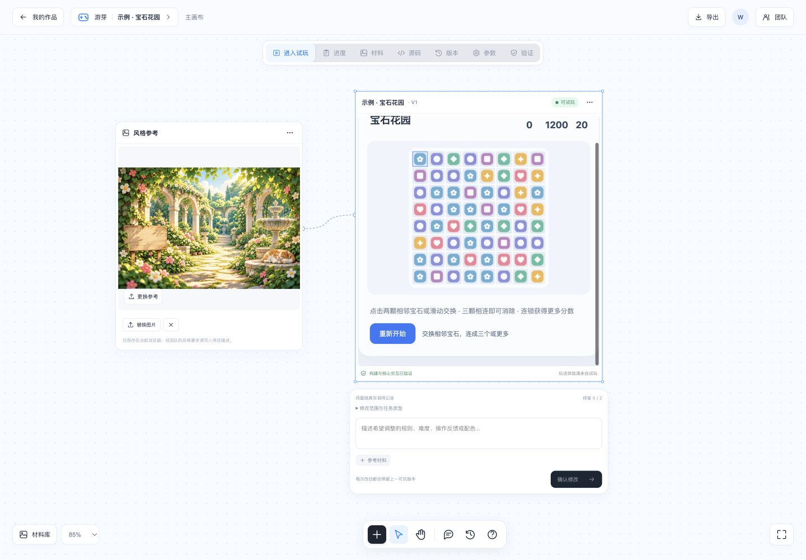

<h1 align="center">🎮 Ludraft · 游芽</h1>

<p align="center">
  <strong>Grow a game idea into something you can play.</strong>
</p>

<p align="center">
  An AI web game workbench for planning, building, playtesting, and iterating on 2D browser games.
</p>

<p align="center">
  Gameplay approval · Eight-role collaboration · Browser playtesting · Version history · Source export
</p>

<p align="center">
  
  
  
  
  
  <a href="LICENSE"></a>
</p>

<p align="center">
  <a href="#features">✨ Features</a> ·
  <a href="#quick-start">🚀 Quick start</a> ·
  <a href="#usage">💬 Usage</a> ·
  <a href="#examples">🖼️ Examples</a> ·
  <a href="#faq">❓ FAQ</a> ·
  <a href="#architecture">🏗️ How it works</a>
</p>

<p align="center">
  <strong>English</strong> · <a href="README.zh-CN.md">简体中文</a>
</p>

<p align="center">
  <a href="docs/assets/ludraft-canvas-home.png">
    
  </a>
  <br>
  <sub>Local workbench screenshot. The current app interface is in Chinese. Click to enlarge.</sub>
</p>

---

<a id="about"></a>

## What is Ludraft?

Ludraft is a local workbench that turns natural-language game requirements into changes to fixed TypeScript + Canvas templates. Describe the mechanics, review the proposed plan and acceptance criteria, then let the team build and test a candidate before publishing a playable version.

The current creation flow supports **collector, dodger, clicker, and 8×8 match-three games**. After the first version, ask for changes, compare source files and parameters, replay earlier versions, roll back, or export the project as a ZIP.

> **Current status:** this is a local MVP. Template builds, controlled execution, and version workflows have recorded test evidence. Real-model end-to-end quality and human playability evaluation remain pending. See the [validation record](docs/VALIDATION.md) and [delivery audit](docs/DELIVERY_AUDIT.md) for the evidence and remaining work.

<a id="features"></a>

## ✨ Features

| | Feature |
| --- | --- |
| 🧭 | **Plan before building** — describe an idea or upload requirements, edit the gameplay proposal, and approve the acceptance criteria before generation. |
| 🤝 | **Eight-role collaboration** — Producer, PM, Game Designer, Lead Programmer, Programmer, Artist, UX, and QA contribute separate deliverables with recorded handoffs and messages. |
| 🎨 | **Canvas workspace** — arrange gameplay and reference cards alongside the playable preview; pan, zoom, and reset the desktop canvas, or use the vertical mobile layout. |
| 🧪 | **Isolated validation** — build and run Chromium interaction checks in Docker; generation failures can trigger up to two repair rounds. |
| 🎮 | **Play in the browser** — preview validated games in a restricted iframe served from a separate origin. |
| 🔁 | **Iterate and recover** — request changes, compare any two versions, replay history, and roll back; failed candidates preserve the last playable version. |
| 🎛️ | **Direct parameter editing** — change supported literal configuration values without a model call, then run container validation before saving a version. |
| 📎 | **Reviewable source materials** — import text, PDF, DOCX, or ZIP files and check extracted text before including it in a task. |
| 🔌 | **Role-specific model connections** — configure shared or independent connections using OpenAI-compatible or Anthropic Messages APIs; inspect available token usage and connection tests. |
| 📦 | **Portable exports** — download source, build output, verification evidence, and collaboration records. |

Task routes also cover bug fixes, visual changes, performance work, configuration changes, independent testing, documentation, code review, and direction research. Their implementation and validation boundaries are described in the [detailed Chinese guide](README.zh-CN.md) and [architecture documentation](docs/ARCHITECTURE.md).

<a id="architecture"></a>

## 🏗️ How it works

The workbench combines role-based planning with fixed build and test tools. The scheduler enforces task dependencies, approvals, and publication checks.

```text
Idea → Producer scopes the work → PM breaks it down → Designer proposes gameplay
                                                           ↓
                                                     User approval
                                                           ↓
                                              PM updates task dependencies
                                                           ↓
                                         Lead Programmer / Artist / UX designs
                                                           ↓
                                                  Programmer implementation
                                                           ↓
                                              Code review + QA test strategy
                                                           ↓
                                             Docker build + browser tests
                                                           ↓
                                            QA analysis + Producer acceptance
                                                           ↓
                                               Publish → Play → Iterate
```

Blocking review findings, tool failures, or rejected delivery prevent publication. Revisions return to the responsible roles; code changes are reviewed and tested again. Clarification requests pause work and require a new plan confirmation after the user replies.

| Layer | Stack | Responsibility |
| --- | --- | --- |
| Workbench | React 18, TypeScript, Vite 6 | Planning, approvals, canvas, preview, source, versions, and settings |
| API and orchestration | Python 3.12, FastAPI, asyncio | Task state, dependencies, cancellation, handoffs, and repairs |
| Local storage | SQLite and filesystem | Projects, runs, events, candidates, and version snapshots |
| Model gateway | HTTPX, Pydantic | Provider connections, structured output validation, and available usage records |
| Game templates | TypeScript, Canvas 2D | Four supported game modes and their parameters |
| Validation | Docker, Playwright, Chromium | Controlled builds, interaction checks, and evidence collection |
| Game preview | Separate FastAPI service, iframe, CSP | Static game preview separated from the management API |

Role rules and selected skills are captured with each invocation, including content, settings version, and SHA-256. Editing a rule does not rewrite historical records. The Artist currently produces visual specifications; AI image generation is not integrated.

<a id="quick-start"></a>

## 🚀 Quick start

### Prerequisites

- Python 3.12 and `uv`.
- Node.js 22+ and npm.
- Docker Desktop or a compatible running Docker environment.
- A reachable model endpoint for AI planning and generation. Model-free examples can be imported first.

The recorded test environment is macOS on Apple Silicon. Native Windows operation has not been verified. Initial setup requires network access to download dependencies, images, and Chromium; game validation containers run without network access.

### 1. Install dependencies

Run from the repository root:

```bash
uv venv --python 3.12 .studio-venv
uv pip install --python .studio-venv/bin/python -r requirements-studio.txt
npm ci --prefix frontend
npm run build --prefix frontend
```

### 2. Build the validation image

```bash
./scripts/build-runner.sh
```

The default base image comes from AWS's public mirror of the official Node image. To use Docker Hub instead:

```bash
docker build --build-arg NODE_IMAGE=node:22-bookworm-slim -t gamedev-runner:1 runner
```

### 3. Start the workbench

```bash
.studio-venv/bin/python scripts/start.py
```

Open [http://127.0.0.1:8080](http://127.0.0.1:8080). The database and runtime directories are initialized automatically. The startup script also starts the separate game preview service on port `8081`.

The first-run guide checks the API, Docker CLI and daemon, runner image, preview service, and saved model connection evidence. Environment checks do not automatically call a model.

```bash
curl http://127.0.0.1:8080/api/health
```

Use `GET /api/diagnostics` for individual checks. Health status and saved configuration do not replace a real model connection test.

### 4. Configure a model

Open **模型与连接** (Models & Connections), enter the API base URL, provider model ID, and API key, then save and test the connection. Expand **八角色独立连接** (Role Connections) to configure and test individual roles. Connection tests call the configured service; they verify connectivity and structured responses, not game-generation quality.

Alternatively, set these variables before starting the service:

| Variable | Purpose | Default |
| --- | --- | --- |
| `STUDIO_MODEL_URL` | Compatible API base URL | `https://api.openai.com/v1` |
| `STUDIO_MODEL` | Model ID | Empty; configuration required |
| `STUDIO_API_KEY` | Model credentials | Empty; some local endpoints do not require a key |
| `STUDIO_DATA_DIR` | Runtime data directory | `.studio` in the repository root |

Saved UI settings take precedence where configured. Retest connections after changing settings or restarting the service. Missing models, invalid responses, and tool failures are reported as errors.

### Local budget mode

To remove local spending and image-attempt limits while keeping accounting, run:

```bash
.studio-venv/bin/python scripts/budget.py unlimited
.studio-venv/bin/python scripts/budget.py status
```

This persistent setting applies to both role-model calls and the OpenGame proxy. Missing prices do not block requests: reported token usage is retained, while cost remains unknown until reconciled. Existing spending and reservations are preserved. Provider billing and service limits still apply.

To explicitly restore local limits, use `scripts/budget.py configure --cap-cny 100 --image-limit 10`. In limited mode, register model rates with `scripts/budget.py price --help` before calling models. Changing modes never clears the ledger.

<a id="usage"></a>

## 💬 Usage

### Create a game

Describe a supported game in the workbench, for example:

```text
Create an 8×8 match-three game with six gem colors, 20 moves,
and a target score of 1,200. Show the score and remaining moves,
and let the player restart after winning or losing.
```

Review and edit the plan, approve it, follow the role deliverables and test results, then play the published version. The standard template flow permits model changes to `src/config.ts`, `src/game.ts`, and `style.css`; generated code cannot change the tests, dependencies, or build commands.

### Iterate, compare, and export

```text
Increase the move limit to 30, lower the target score to 1,000,
and change the gem palette to softer colors.
```

Approve the revised plan and inspect the resulting differences. Use **对比** (Compare) to compare two versions, or **参数** (Parameters) for supported direct edits. Parameter edits also require successful container validation. A historical preview does not change the active version; rollback is an explicit action.

Exports include source, build output, verification evidence, licenses, and `RUN_GAME.md`. Follow that file to serve the exported game locally. An existing build can be played without the workbench or a model key; editing TypeScript requires rebuilding.

### Add materials and references

Upload requirements, inspect the extracted content, then choose **核对并用于本轮需求** (Confirm and use for this task). Each file may be up to 8 MB, with up to eight materials per task. Scanned PDFs require text conversion first; OCR is not supported.

Canvas reference images stay in the current browser's IndexedDB. They are not automatically sent to the model or included in game exports. Put visual requirements the team should follow into the task text.

<a id="examples"></a>

## 🖼️ Examples

Import four hand-authored examples. Each is published only after real container validation; the import does not call a model.

```bash
.studio-venv/bin/python scripts/seed_examples.py
```

| Example | Mode | Gameplay |
| --- | --- | --- |
| Gem Garden · 宝石花园 | `match3` | Six gem colors, 20 moves, target score of 1,200 |
| Starlight Collector · 星光收集站 | `collector` | Catch coins and avoid bombs; three lives, 60 seconds |
| Meteor Dodge · 流星闪避 | `dodger` | Score by surviving; three lives, 60 seconds |
| Light Up the Stars · 点亮星星 | `clicker` | Click targets and avoid hazards; three lives, 30 seconds |

<p align="center">
  <a href="docs/assets/ludraft-canvas-project.png">
    
  </a>
  <br>
  <sub>Project canvas. Screenshots illustrate the interface, not real-model generation quality.</sub>
</p>

[Mobile workspace](docs/assets/ludraft-canvas-mobile.png) · [Team panel](docs/assets/ludraft-team.png) · [Setup guide](docs/assets/ludraft-setup.png) · [Example walkthrough](docs/examples/DEMO.md)

<a id="faq"></a>

## ❓ FAQ

**How does this differ from asking a chatbot to write a game?**

Ludraft adds an approved gameplay plan, separate role deliverables, controlled file edits, real build and browser checks, and persistent versions. You can inspect what changed and recover the previous playable build when an iteration fails.

**Can I try it without a model API key?**

Yes. Run the local services and import the examples to explore previews, source, comparison, and exports. Docker and the runner image are still required for import and parameter validation. Natural-language planning and generation require a working model connection.

**Is there a public online demo?**

There is currently no public hosted demo. The complete workbench needs the local API, SQLite, and Docker; publishing only the frontend does not provide the full workflow.

**Does it support other engines or arbitrary games?**

The current creation flow supports the four Canvas modes listed above. A Phaser tower-defense template is undergoing integration and is not open for natural-language creation. Unity, Unreal, arbitrary dependency installation, AI art generation, and online multiplayer are outside the current scope. See the [integration plan](docs/OPENGAME-INTEGRATION-PLAN.md).

**Does a passing test report mean the game is good?**

It means the recorded checks passed. Template regression, fixed model-response integration tests, real-model evaluation, and human playability ratings are separate evidence categories. Custom gameplay and overall quality still need manual playtesting.

<a id="structure"></a>

## 📁 Project structure

```text
frontend/                  React workbench and retained upstream pages
  src/Studio.tsx           Current workbench entry
  src/TeamPanels.tsx       Role status, deliverables, and model assignments
studio/                    FastAPI, model gateway, workflow, and versions
templates/canvas/          Collector, dodger, and clicker templates
templates/match3/          Dedicated 8×8 match-three template
templates/phaser/          Engine integration work, not a released creation flow
runner/                    Docker images and fixed validation tools
scripts/                   Startup, example import, and evaluation commands
tests/                     Protocol, workflow, failure, and integration checks
docs/                      Architecture, evidence, screenshots, and provenance
src/                       Upstream role-based reference implementation
rules/                     Upstream role rules, skills, and workflow materials
.studio/                   Local runtime data; excluded from version control
```

| Documentation | Contents |
| --- | --- |
| [中文完整说明](README.zh-CN.md) | Detailed Chinese setup, usage, task routes, and API reference |
| [Architecture and API](docs/ARCHITECTURE.md) | Task states, model protocols, version management, and endpoints |
| [Validation record](docs/VALIDATION.md) | Recorded checks, evidence boundaries, and pending validation |
| [Delivery audit](docs/DELIVERY_AUDIT.md) | Delivered scope and remaining acceptance work |
| [Provenance](docs/PROVENANCE.md) | Upstream reuse, additions, and adaptations |
| [Upstream README](docs/UPSTREAM_README.md) | Preserved original project documentation |

The detailed supporting documents are currently in Chinese.

<a id="tests"></a>

## 🧪 Tests and evaluation

### Development checks

```bash
.studio-venv/bin/python -m pytest tests -q
npm run typecheck --prefix frontend
npm run build --prefix frontend
```

Enable real Docker integration checks explicitly:

```bash
STUDIO_DOCKER_TESTS=1 .studio-venv/bin/python -m pytest tests/test_docker_integration.py -q
```

Unit tests use model and runner doubles where indicated. Docker integration tests use fixed model responses with real containers. Neither measures real-model generation quality.

### Template and real-model evaluation

```bash
# Five fixed requirements, three container runs each; no model calls
.studio-venv/bin/python scripts/evaluate.py --output .studio/evaluation-template

# Real-model evaluation; requires a configured model and consumes API quota
.studio-venv/bin/python scripts/evaluate.py --live --output .studio/evaluation-live
```

Use a new output directory for each evaluation. The default suite covers two match-three requirements and one each for collector, dodger, and clicker. Reports include build and interaction results, parameter checks, repair rounds, version evidence, and available model usage. Missing usage remains unknown, and human playability ratings remain empty until manually supplied.

The stored [cross-mode template regression](docs/evidence/mixed-template-regression.json) records **15/15 successful build, interaction, and parameter checks**. This is template evidence, not an AI generation success rate or a human quality score. See the [validation record](docs/VALIDATION.md) for context.

<a id="preview"></a>

### Local development

Keep the backend running and start Vite in a second terminal:

```bash
npm run dev --prefix frontend
```

| Address | Purpose |
| --- | --- |
| `http://127.0.0.1:8080` | Built workbench and management API |
| `http://127.0.0.1:5173` | Vite development frontend |
| `http://127.0.0.1:8081/v/{version_id}/index.html` | Separate game preview, loaded by the workbench |

The current entry points are `frontend/src/Studio.tsx` and `scripts/start.py`. The upstream `_start_web.py` is retained for reference. Restart the service after backend changes; running tasks are marked failed on restart, while pending approvals and playable versions are preserved.

<a id="security"></a>

## 🔒 Data and execution boundaries

- Runtime data stays under `.studio/`, including SQLite, candidates, versions, and model settings. Use one management process per data directory.
- API keys saved through the UI are stored in `.studio/model.json` with `0600` file permissions. This is a local configuration file, not an encrypted credential vault. Configuration responses do not return raw keys, and the runner does not receive them.
- With remote models, requirements, selected material text, relevant code, and test context are sent to the configured provider. Local storage does not imply local inference.
- Uploaded originals remain local. Exported requirements include the checked text and provenance, not the original binary uploads. Document parsing runs in a separate process and does not have the build container's filesystem and network isolation.
- Management and preview services bind to loopback by default. The local API validates Host and Origin.
- Validation containers have no network access, a read-only root filesystem, dropped capabilities, and resource/time limits. Only a temporary copy of the candidate project is mounted.
- Game previews use a separate origin, a restricted iframe, and CSP. Published snapshots are application-immutable and read-only, although the local file owner can still alter them outside the app.

For detailed limits, see [architecture and security documentation](docs/ARCHITECTURE.md).

<a id="license"></a>

## 📄 License and acknowledgments

The experimental Phaser tower-defense template also includes Apache-2.0-licensed OpenGame code. Its pinned source revision, file attribution, and licenses are kept in [the template's licenses directory](templates/phaser/tower_defense/licenses/).

When reporting a problem, include your platform, Python / Node.js / Docker versions, reproduction steps, and redacted logs. Do not include API keys, model configuration files, or the runtime database.
